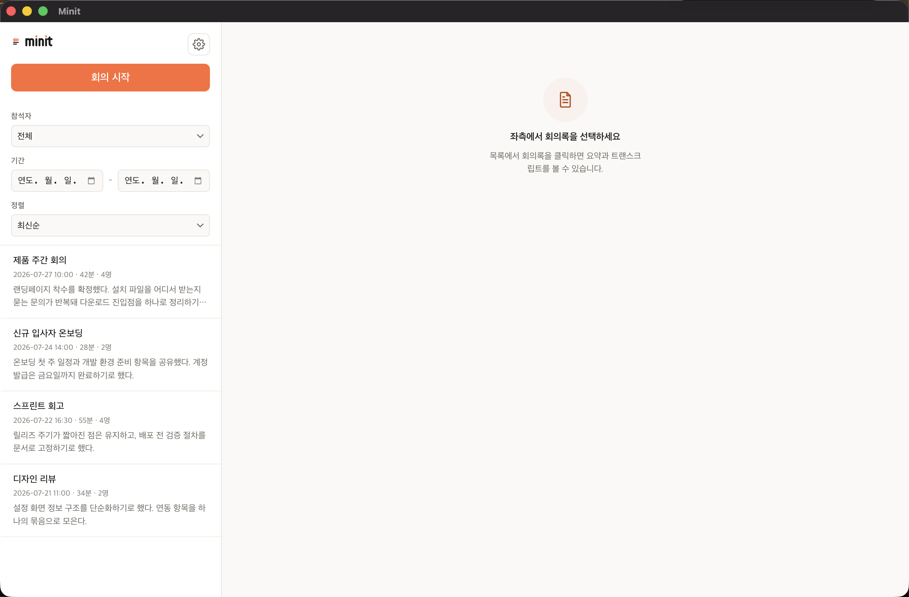

앱은 실행 즉시 바로 쓸 수 있습니다. 설정을 미리 맞출 필요는 없습니다.

## 실행 직후 일어나는 일

**음성 인식 모델을 한 번 내려받습니다(약 1.6GB).**
우측 하단에 설치 패널이 뜹니다. 다운로드가 끝나기 전까지는 **"회의 시작"만 비활성**이고
나머지 화면은 그대로 쓸 수 있습니다. 한 번 받으면 다시 받지 않습니다.

**GitHub 로그인 팝업이 함께 뜹니다.**
선택 사항입니다. **"로그인 없이 사용하기"** 를 눌러 건너뛰어도 모든 기능을 그대로 씁니다.
나중에 설정에서 언제든 연결할 수 있습니다. → [GitHub 백업](../github-backup/)

**Claude Code CLI를 쓸 수 없으면 안내가 뜹니다.**
요약 생성에만 필요합니다. 없어도 녹음과 받아쓰기는 그대로 동작하므로 **회의 시작을 막지
않습니다.**

앱은 실행할 때 한 번 Claude를 실제로 호출해 **설치됐는지가 아니라 지금 요약을 만들 수
있는지**를 확인합니다. 설치는 됐는데 로그인이 안 되어 있거나 사용량이 남아 있지 않은 경우를
회의가 끝난 뒤가 아니라 미리 알려주기 위해서입니다. 확인에 쓰는 호출은 한 단어짜리라
사용량에는 사실상 영향이 없습니다.

안내 카드에서 무엇을 해야 하는지(설치·로그인·한도 대기)를 알려주며, 설정 → **Claude**에서
언제든 상태를 다시 확인할 수 있습니다.

## 회의록이 저장되는 곳

기본값은 `~/.minit` 입니다. 설정(톱니 아이콘) → **회의록 저장 위치**에서 바꿀 수 있습니다.

저장 위치를 로컬 git 저장소로 지정하면 회의록이 저장될 때마다 자동으로 커밋됩니다.

## 녹음 원본은 7일 뒤 지워집니다

회의록 저장이 끝난 뒤에도 원본 오디오가 **로컬에 최대 7일 보존**된 뒤 자동 삭제됩니다.
인식이 이상한 회의를 다시 확인하거나 복구하기 위한 것이며, 오디오는 기기 밖으로 나가지
않습니다. → [데이터 처리](../privacy/)

:::note[앱에서 보이는 "전사"]
회의를 끝내면 앱이 **전사 → 요약 → 저장** 순으로 진행 상황을 보여줍니다.
여기서 "전사(받아쓰기)"는 녹음된 말을 글로 옮기는 단계로, 이 문서에서 말하는
"회의 내용"을 만드는 과정입니다.
:::

## 다음 단계

준비가 끝났다면 [회의록 만들기](../recording/)에서 실제로 회의를 녹음하고 결과를 공유하는
흐름을 확인하세요.
