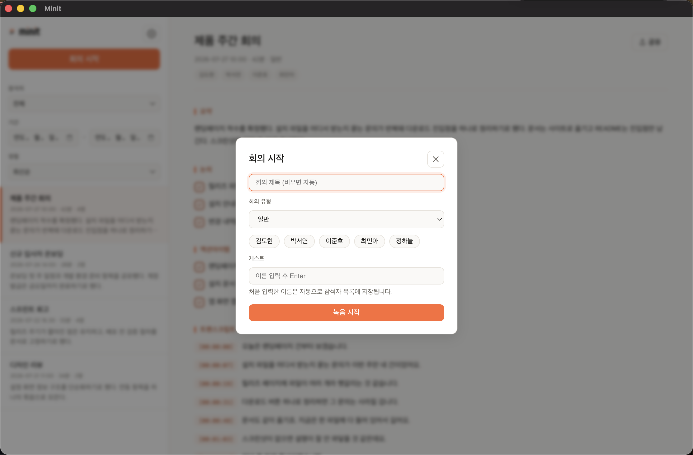
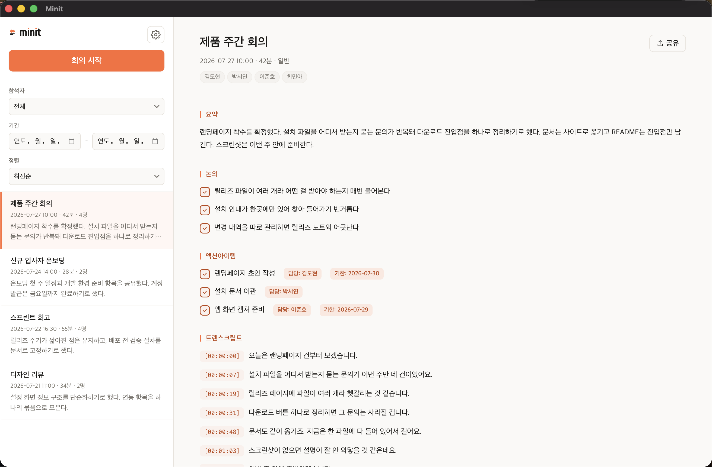
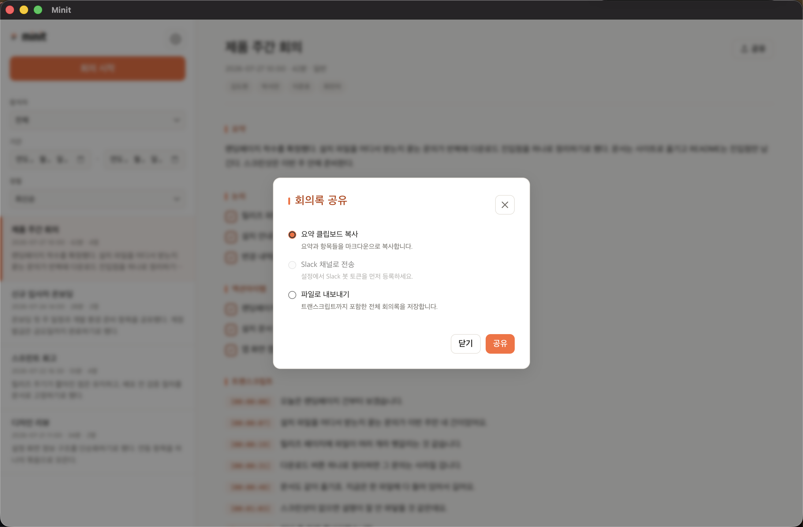
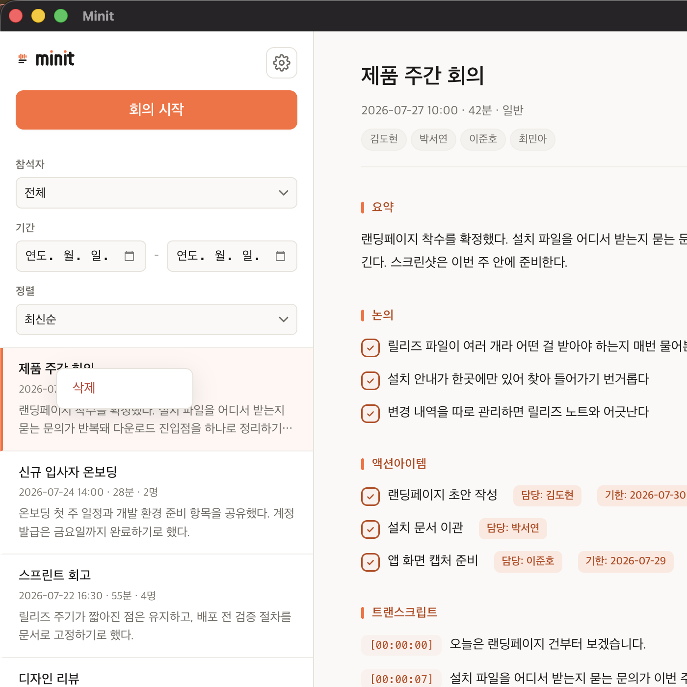

녹음부터 공유까지의 전체 흐름입니다.

## 1. 회의 시작

왼쪽 위 **회의 시작** 버튼을 누릅니다.

| 항목 | 설명 |
| --- | --- |
| **회의 제목** | 비우면 날짜로 자동 생성됩니다 |
| **회의 유형** | 유형에 따라 요약 구성이 달라집니다(예: 일반, 회고) |
| **참석자** | 저장된 명단에서 눌러 선택합니다 |
| **게스트** | 명단에 없는 사람은 이름을 입력하고 Enter. 처음 입력한 이름은 자동으로 명단에 저장됩니다 |

**녹음 시작**을 누르면 녹음이 시작됩니다. 최초 녹음 시 macOS가 마이크 권한을 요청합니다.

:::note[무엇이 녹음되나요]
**마이크 입력만** 녹음됩니다. 컴퓨터에서 재생되는 소리(화상회의 상대방 음성 등)는
녹음되지 않습니다. 마주 앉아서 하는 회의를 위한 앱입니다.
:::

녹음 중에는 메뉴바 트레이 아이콘에서도 바로 종료할 수 있습니다.

## 2. 회의 종료 후 기다리기

회의를 끝내면 앱이 **전사 → 요약 → 저장** 세 단계를 자동으로 진행합니다.
사이드바의 해당 회의에 진행 상태가 표시됩니다. 회의 길이에 따라 몇 분이 걸릴 수 있습니다.

요약과 액션아이템 생성에는 Claude Code CLI가 필요합니다. 설치되어 있지 않으면
**회의 내용까지만 저장**되고 요약은 비어 있습니다. 이때 회의록 화면에서 **요약 재생성**을
누르면 실패한 이유를 알려줍니다. → [문제 해결](../troubleshooting/)

## 3. 회의록 보기

목록에서 회의를 누르면 오른쪽에 회의록이 열립니다.

- **요약** — 회의의 핵심을 문단으로
- **논의·잘된 점** 등 — 회의 유형에 따라 달라지는 섹션
- **액션아이템** — 담당자와 기한이 함께 정리됩니다
- **트랜스크립트** — 발언이 시각과 함께 기록됩니다

요약이 마음에 들지 않으면 다시 생성할 수 있습니다.

### 목록에서 찾기

사이드바 위쪽에서 **참석자**·**기간**으로 거르고 **정렬**을 바꿀 수 있습니다.
"누가 있었던 회의였는지"만 기억나도 찾을 수 있습니다.

## 4. 공유하기

회의록 오른쪽 위 **공유** 버튼을 누릅니다.

| 방법 | 내용 |
| --- | --- |
| **요약 클립보드 복사** | 요약과 항목들을 마크다운으로 복사합니다. 메신저·문서에 그대로 붙여넣습니다 |
| **Slack 채널로 전송** | 지정한 채널로 보냅니다. 먼저 봇 토큰을 등록해야 활성화됩니다 → [Slack 설정](../slack/) |
| **파일로 내보내기** | 트랜스크립트까지 포함한 전체 회의록을 파일로 저장합니다 |

회의가 끝날 때마다 Slack으로 **자동 발송**되게 할 수도 있습니다(기본값은 발송 안 함).

## 5. 지우기

목록에서 회의록을 **오른쪽 클릭**하면 삭제 메뉴가 나옵니다.

- 지운 파일은 **휴지통으로 이동**합니다. 실수로 지웠다면 되돌릴 수 있습니다
- 회의록을 git 저장소에 보관 중이라면 삭제도 함께 기록됩니다
- GitHub 동기화를 쓰고 있다면 다른 기기의 사본도 함께 삭제됩니다

## 관련 문서

- [GitHub 백업](../github-backup/) — 회의록을 저장소에 자동 백업하고 팀원과 공유
- [Slack 자동 발송](../slack/) — 회의가 끝나면 요약을 채널로 자동 발송
- [문제 해결](../troubleshooting/) — 요약이 안 나올 때, 녹음이 안 될 때
